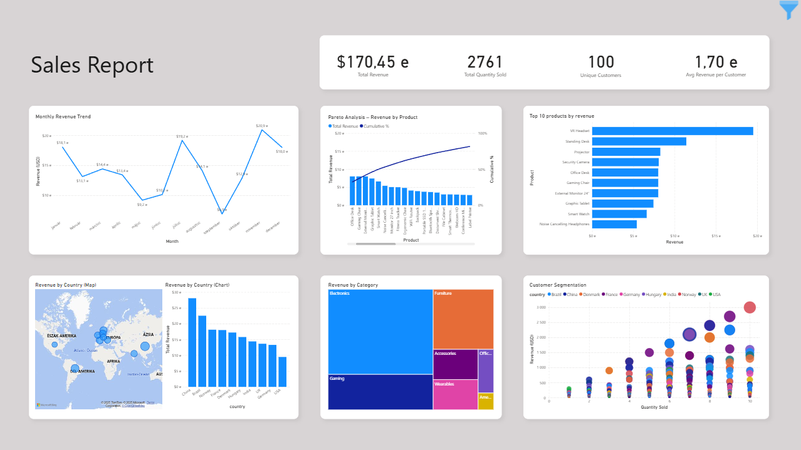

# 🚀 From Business Ops to Data Engineering  

Hi, I'm **Gabor Barta** 👋  

I’m a **Data Professional** blending **Data Engineering** and **Data Analytics** to deliver end-to-end solutions.  
My projects span **automated ETL pipelines, API integrations, ML-based forecasts**, and **interactive dashboards** — all aimed at turning raw data into **reliable workflows and impactful insights**.  

## 🌍 Socials 
           

---

## 💻 Tech Stack  
**Languages & Tools**  
                    

 

---

## 📌 Featured Projects  

🔹 **[Crypto price forecast](https://github.com/bartagabor1/Crypto-price-forecast)**  
*A full-stack crypto ML project predicting BTC, ETH, and SOL prices using LSTM, Prophet, and XGBoost ensemble models. Daily Binance data updates, automated workflow, and interactive visualizations for actionable insights.*  

🔹 **[Investment portfolio](https://github.com/bartagabor1/Investment-portfolio)**  
*A comprehensive database model for investment portfolios, including stocks, bonds, real estate, and more. Includes tables for transactions, returns, clients, and portfolios.*  

🔹 **[CSV data cleaning](https://github.com/bartagabor1/csv-data-cleaning-portfolio)**  
*Reusable Python scripts for cleaning messy datasets (CSV/Excel → clean & analysis-ready).* 

🔹 **[Crypto etl pipeline](https://github.com/bartagabor1/Crypto_etl_pipeline)**  
*Retrieves hourly cryptocurrency price data for the past 7 days using CoinGecko API (interval inferred automatically).* 

🔹 **[Mock finance analyzer](https://github.com/bartagabor1/Mock-finance-analyzer)**  
*Financial analysis project demonstrating how to process and visualize transaction data using Python, Pandas, SQL, and Streamlit.* 

🔹 **[Sales report automation](https://github.com/bartagabor1/Sales-report-automation)**  
*Automated Sales Reporting Workflow using Python & Power BI – data cleaning, Excel reporting, interactive dashboards, and email automation.* 

---

### ⚡ *"Turning data into decisions — empowering finance with code and insights."*
